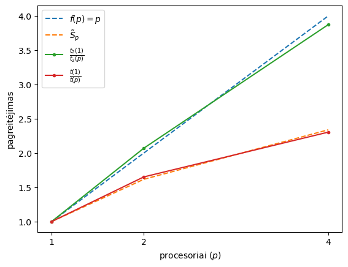
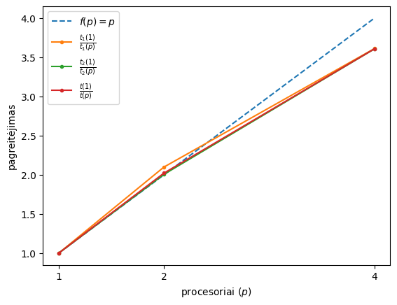

# Ataskaita

## Algoritmo analizė

### Parametrų parinktis

| numDP | numCL |
| :---: | :---: |
| 5000  |  50   |

### Teorinio pagreitėjimo vertinimas

$$
\begin{align}
\alpha\approx 0.2367\\
\beta\approx 0.7632\\
\tilde{S}_2=\frac{1}{\alpha+\frac{\beta}{2}}\approx 1.6171\\
\tilde{S}_4=\frac{1}{\alpha+\frac{\beta}{4}}\approx 2.3389\\
\tilde{S}_{max}=\lim_{p\to\infty}\frac{1}{\alpha+\frac{\beta}{p}}=\frac{1}{\alpha}\approx 4.2241\\
\end{align}
$$

## Bendros atminties lygiagrečiojo algoritmo sudarymas

## Pirma dalis

Čia $p$ - procesorių skaičius, $t(p)$ - eksperimentiniu būdu išmatuotas visos programos veikimo laikas, $t_2(p)$ - eksperimentiniu būdu išmatuotas sprendinio paieškos laikas, $\tilde{S}_p$ - teorinis programos veikimo laiko pagreitėjimas.

## Antra dalis

Čia $t_1(p)$ - eksperimentiniu būdu išmatuotas atstumų matricos sudarymo laikas.
