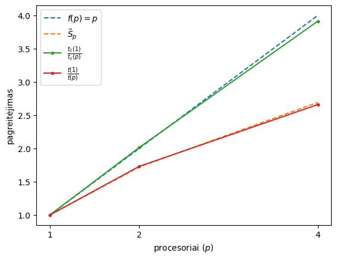

# Ataskaita

## Algoritmo analizė

### Parametrų parinktis

Parametrai parinkti eksperimentiniu būdu.

| numDP | numCL |
| :---: | :---: |
| 5000  |  55   |

| $\overline{t_1}(1)$ | $\overline{t_2}(1)$ |
| :-----------------: | :-----------------: |
|       4.7148        |       24.4358       |

### Teorinio pagreitėjimo vertinimas

```math
\begin{align}
\alpha&\approx 0.1617 \\
\beta&\approx 0.8383 \\
\tilde{S}_2&=\frac{1}{\alpha+\frac{\beta}{2}}\approx 1.7215\\
\tilde{S}_4&=\frac{1}{\alpha+\frac{\beta}{4}}\approx 2.6931\\
\tilde{S}_{max}&=\lim_{p\to\infty}\frac{1}{\alpha+\frac{\beta}{p}}=\frac{1}{\alpha}\approx 6.1827\\
\end{align}
```

## Bendros atminties lygiagrečiojo algoritmo sudarymas

Abejoms užduoties dalims išlygiagretinti buvo naudojamas omp užduočių konceptas.

## Pirma dalis

### Algoritmo sudarymas

Kadangi išorinis ciklas keičia masyvą `X` - jo lygiagretinti negalime iš esmės nekeisdami programos kodo, todėl jį vykdo viena gija, tačiau galime sukurti `omp` užduotis brangioms, pasikartojančioms `evaluateSolution` procedūroms, kurias vykdys kelios gijos. Kadangi ieškome geriausio sprendinio turime užtikrinti, kad sprendinio priskyrimas būtų atomiška operacija, todėl ją pažymime su `critical` direktyva. Taip pat svarbu pastebėti, kad originaliame užduoties kode geriausias sprendinys priskiriamas iš keliose gijose keičiamo `X`, todėl turime kiekvienai gijai padaryti po kopiją, kad išvengtume "race conditions". 

### Kodas

```cpp
#pragma omp parallel
{
    #pragma omp single
    {
        while (increaseX(X, numX - 1, numCL) == true)
        {
            int threadLocalX[numX];
            memcpy(threadLocalX, X, sizeof(threadLocalX));

            #pragma omp task firstprivate(threadLocalX) private(u) shared(bestU, bestX, numX)
            {
                u = evaluateSolution(X);

                #pragma omp critical
                {
                    if (u > bestU)
                    {
                        bestU = u;
                        for (int i = 0; i < numX; i++)
                            bestX[i] = threadLocalX[i];
                    }
                }	
            }
        }
    }
}
```

### Rezultatas



Čia $p$ - procesorių skaičius, $t(p)$ - eksperimentiniu būdu išmatuotas visos programos veikimo laikas, $t_2(p)$ - eksperimentiniu būdu išmatuotas sprendinio paieškos laikas, $\tilde{S}_p$ - teorinis programos veikimo laiko pagreitėjimas.

## Antra dalis

### Algoritmo sudarymas

Galime pastebėti, kad kiekviena matricos eilutė yra inicializuojama individualiai, todėl darbą būtų galima padalinti kelioms gijoms, tačiau yra problema - kiekviena matricos eilutė yra vienu nariu ilgesnė nei praeita, jei tolygiai paskirstytume eilutes kelioms gijoms - jū darbas būtų labai nevienodas, todėl šioje situacijoje geriau naudoti `omp` užduotis. Kaip ir praeitame pavizdyje, užduotis kuria tik viena gija, o kitos gijos jas vykdo.

```c++
distanceMatrix = new double *[numDP];
#pragma omp parallel
{
    #pragma omp single
    for (int i = 0; i < numDP; i++)
    {
        #pragma omp task firstprivate(i) shared(distanceMatrix, demandPoints)
        {
            distanceMatrix[i] = new double[i + 1];
            for (int j = 0; j <= i; j++)
            {
                distanceMatrix[i][j] = HaversineDistance(demandPoints[i][0], demandPoints[i][1], demandPoints[j][0], demandPoints[j][1]);
            }
        }
    }
}
```


Čia $t_1(p)$ - eksperimentiniu būdu išmatuotas atstumų matricos sudarymo laikas.
