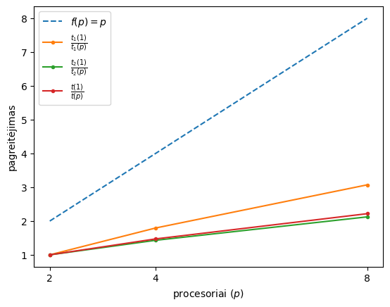

# Paskirstytos atminties lygiagrečiojo algoritmo sudarymas

## Atstumų matricos skaičiavimas 

Algoritmas veikia *master-slave* principu - kiekvienas pavaldus procesas paraleliai ir nepriklausomai inicializuoja atitinkamą kiekį matricos eilučių ir siunčia jas pagrindiniam procesui. Pagrindinis procesas užpildo gautomis matricos eilutėmis visą atstumų matricą. Siekiant, kad pavaldžių procesų darbo krūvis būtų vienodas, eilutės nėra imamos iš eilės, o imamos alternuojančia tvarka.

### Kodas

```cpp
if( 0 != world_rank )
{
  double *local_result = new double[ numDP ];
  for ( int i = 0; i < lines_count; ++i )
  {
    const int line_index = (world_rank - 1) + i * (world_size - 1);
    const int result_length = line_index + 1;
    if ( result_length > numDP )
      break;
    demand_point_t const& from = demandPoints[ line_index ];
    for ( int j = 0; j < result_length; ++j )
      local_result[ j ] = HaversineDistance( from, demandPoints[ j ] );
    MPI_Send(local_result, numDP, MPI_DOUBLE, 0, line_index, MPI_COMM_WORLD);
  }
}
else
{
    double *buffer = new double[ numDP ];
    MPI_Status status;
    for ( int i = 1; i < world_size; ++i )
    {
      const int max_line_index = i - 1 + (lines_count - 1) * (world_size - 1);
      const int actual_line_count = max_line_index + 1 > numDP ? lines_count - 1 : lines_count;
      for ( int j = 0; j < actual_line_count; ++j )
      {	
        MPI_Recv(buffer, numDP, MPI_DOUBLE, MPI_ANY_SOURCE, MPI_ANY_TAG, MPI_COMM_WORLD, &status);
        const int line_index = status.MPI_TAG;
        const int buffer_length = line_index + 1;
        memcpy(distanceMatrix[ line_index ], buffer, buffer_length * sizeof(double));
      }
    }
}
```

## Sprendinio paieška

Sprendinio paieška taip pat vykdoma tuo pačiu principu - pavaldžios užduotys pagrindiniam procesui nenustodamos siuntinėja užklausas gauti darbo. Pagrindinis procesas į šias užklausas atsako su dabartiniu sprendiniu `X`, kurį reikia įvertinti. Pavaldus procesai įvertine sprendinį pagrindiniam procesui siučia atgal sprendinio vertinimą. Kai pagrindinis procesas atlieka pilna perrinkimą, nustoja priimti užduočių užklausas iš pavaldžių procesų ir įsako jiems nustoti prašyti darbo. Prieš pradedant ši algoritmą, kiekvienas pavaldus procesas gauna atstumų matricos kopiją.  

### Kodas

```c++
MPI_Status status;
// Matricų kopijavimas
if( 0 == world_rank )
{
  for ( int i = 1; i < world_size; ++i )
    for ( int j = 0; j < numDP; ++j )
      MPI_Send(distanceMatrix[j], j + 1, MPI_DOUBLE, i, j, MPI_COMM_WORLD);
}
else
{
  for ( int i = 0; i < numDP; ++i )
    MPI_Recv(distanceMatrix[i], i + 1, MPI_DOUBLE, 0, i, MPI_COMM_WORLD, &status);
}

// Sprendinio paieška
if( 0 == world_rank ) // Pagrindinis procesas priema darbo užklausas
{
  for ( int i = 0; i < numX; i++ )
  {
    X[i] = i;
    bestX[i] = i;
  }
  
  u = evaluateSolution(X);
  bestU = u;

  // Darbo priskyrimas
  int messages_sent = 0, tmp;
  while ( increaseX(X, numX - 1, numCL) == true )
  {
    MPI_Recv(&tmp, 1, MPI_INT, MPI_ANY_SOURCE, 0, MPI_COMM_WORLD, &status);
    MPI_Send(X, numX, MPI_INT, status.MPI_SOURCE, 0, MPI_COMM_WORLD);
    ++messages_sent;
  }

  // Darbo rezultatų surinkimas
  for ( int messages_received = 0; messages_received < messages_sent; ++messages_received )
  {
    MPI_Recv(&u, 1, MPI_DOUBLE, MPI_ANY_SOURCE, 1, MPI_COMM_WORLD, &status);
    if ( u > bestU )
    {
      bestU = u;
      memcpy(bestX, X, numX * sizeof(double));
    }
  }

  for ( int i = 1; i < world_size; ++i ) {
    MPI_Send(&X, numX, MPI_INT, i, 2, MPI_COMM_WORLD);
  }
}
else // Pvaldūs procesai prašo darbo
{
    while(true)
    {
      MPI_Send(&world_rank, 1, MPI_INT, 0, 0, MPI_COMM_WORLD);
      MPI_Recv(X, numX, MPI_INT, 0, MPI_ANY_TAG, MPI_COMM_WORLD, &status);
      if( 2 == status.MPI_TAG ) break; // Gautas įsakymas baigti darbą
      u = evaluateSolution(X);
      MPI_Send(&u, 1, MPI_DOUBLE, 0, 1, MPI_COMM_WORLD);
    }
}
```

# Rezultatai



Čia $p$ - procesorių skaičius, $t(p)$ - eksperimentiniu būdu išmatuotas visos programos veikimo laikas, $t_1(p)$ - eksperimentiniu būdu išmatuotas atstumų matricos sudarymo laikas, $t_2(p)$ - eksperimentiniu būdu išmatuotas sprendinio paieškos laikas.